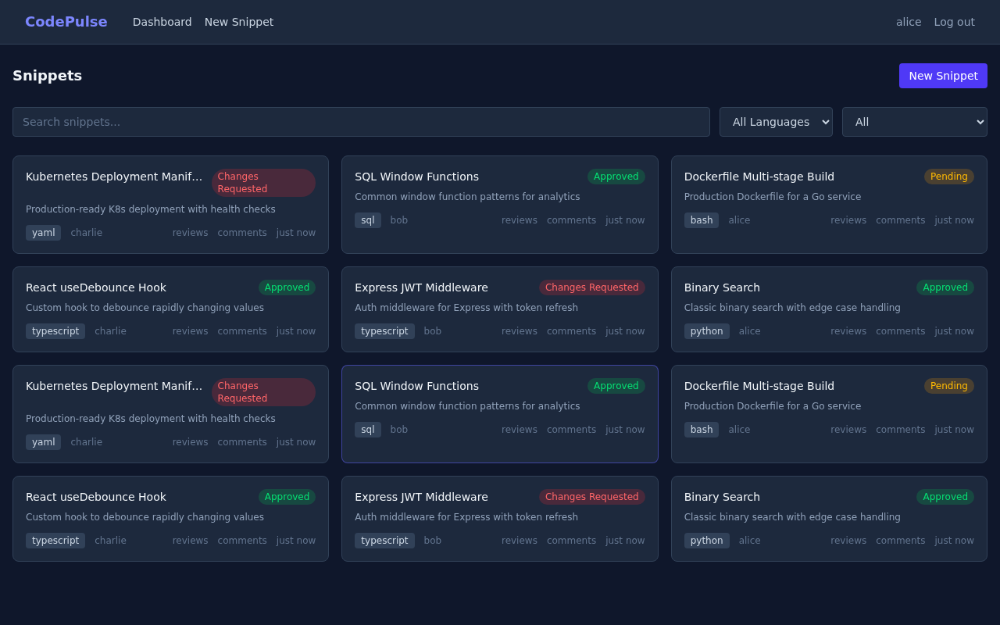
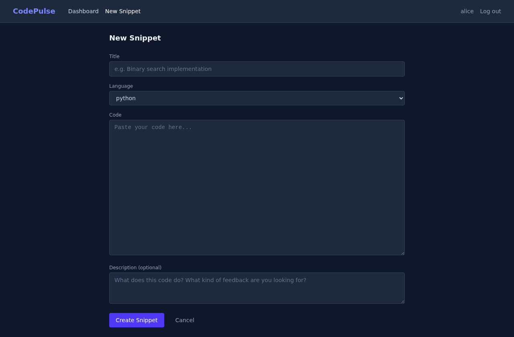
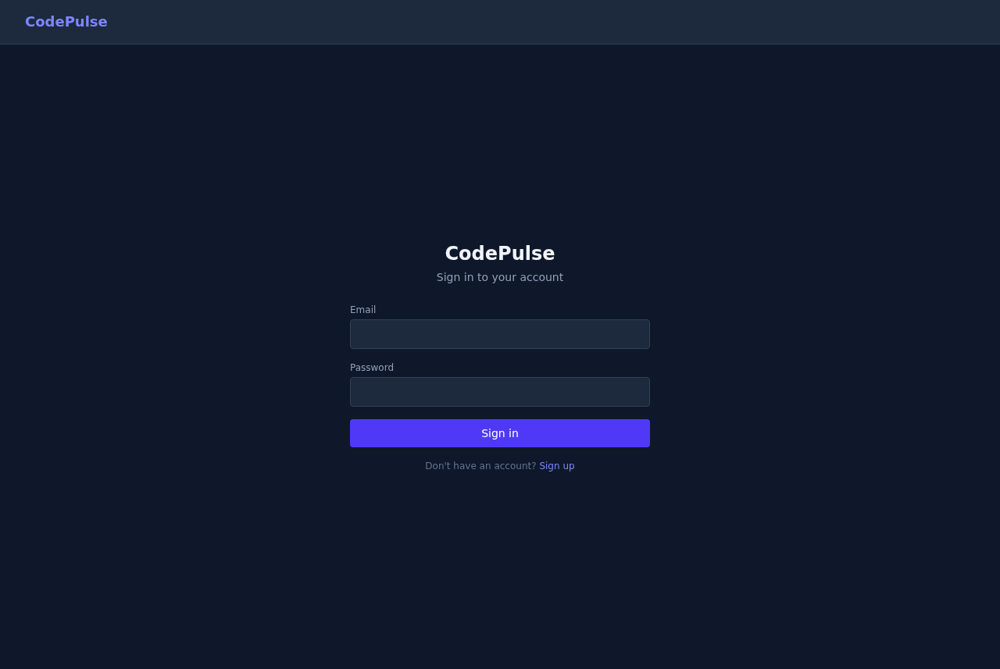

# CodePulse

A code review platform where developers share snippets and get line-by-line feedback from peers.







## Stack

- **Frontend:** React 19, TypeScript, Tailwind CSS, Vite
- **Backend:** FastAPI, SQLAlchemy (async), PostgreSQL
- **Infrastructure:** Docker Compose, Redis, GitHub Actions CI
- **Testing:** Pytest (69 tests), Vitest + React Testing Library (83 tests), Playwright E2E
- **Code Quality:** ESLint, Ruff, pre-commit hooks

## Architecture

```
React + TypeScript ──── REST API ──── FastAPI
                                        ├── PostgreSQL (data)
                                        └── Redis (cache, sessions)
```

## Features

- JWT authentication (register, login, session management)
- Submit code snippets in 17+ languages with syntax highlighting
- Line-by-line commenting on code
- Peer reviews with approve / request changes workflow
- Snippet status tracking (pending, in review, approved, changes requested)
- Search and filter dashboard
- Authorization: only snippet owners can edit/delete their own code

## Getting Started

### Prerequisites

- Docker and Docker Compose

### Run locally

```bash
cp .env.example .env
docker compose up --build
```

Frontend: http://localhost:3000
API docs: http://localhost:8000/docs

### Development (without Docker)

**Backend:**

```bash
cd backend
poetry install
poetry run uvicorn app.main:app --reload
```

**Frontend:**

```bash
cd frontend
npm install
npm run dev
```

### Seed mock data

Once the app is running, populate it with sample users, snippets, reviews, and comments:

```bash
pip install httpx  # only dependency
python scripts/seed.py
```

The script hits the API at `http://localhost:8000` (works whether the API runs via Docker or locally).

Three users are created (password for all: `password123`):
- `alice@codepulse.dev`
- `bob@codepulse.dev`
- `charlie@codepulse.dev`

## Testing

152 tests across backend and frontend, all running in CI.

```bash
# backend (69 tests)
cd backend && poetry run pytest tests/ -v

# frontend unit tests (83 tests)
cd frontend && npm test

# frontend e2e
cd frontend && npm run test:e2e
```

**Backend test coverage:**
- Auth endpoints and edge cases (registration, login, token validation, duplicates)
- Snippet CRUD (create, read, update, delete, authorization, 404s)
- Reviews and comments (submission, status transitions, self-review prevention)
- Security (password hashing, JWT creation/decode, expiry, tampering)
- Schema validation (Pydantic models for all request/response types)
- Integration tests (full multi-user review flows, authorization boundaries)
- Health and OpenAPI schema

**Frontend test coverage:**
- Components (Navbar, CodeViewer, SnippetCard, StatusBadge, ReviewPanel, CommentThread, ProtectedRoute)
- Pages (Login, Register, Dashboard, NewSnippet)
- API client layer (auth, snippets, reviews, error handling, token interceptor)
- Hooks (useAuth, useSnippets)
- Context (AuthContext initialization, token persistence, logout)
- Routing (protected routes, redirects)

### Pre-commit hooks

Lint and test checks run automatically before every commit:

```bash
pip install pre-commit
pre-commit install
```

## API

Interactive docs available at `/docs` when the backend is running.

Key endpoints:

- `POST /api/auth/register` - create account
- `POST /api/auth/login` - get access token
- `GET /api/auth/me` - current user profile
- `GET /api/snippets` - list all snippets
- `POST /api/snippets` - submit code for review
- `GET /api/snippets/{id}` - snippet detail with reviews and comments
- `PUT /api/snippets/{id}` - update snippet (owner only)
- `DELETE /api/snippets/{id}` - delete snippet (owner only)
- `POST /api/snippets/{id}/reviews` - review a snippet
- `POST /api/snippets/{id}/comments` - add line comment

## Project Structure

```
codepulse/
  backend/
    app/
      api/          # route handlers (auth, snippets, reviews)
      models/       # SQLAlchemy models (User, Snippet, Review, Comment)
      schemas/      # Pydantic request/response schemas
      services/     # business logic layer
      core/         # config, JWT security, dependency injection
    tests/          # 69 pytest tests
  frontend/
    src/
      components/   # reusable UI (CodeViewer, ReviewPanel, Navbar, etc.)
      pages/        # route pages (Dashboard, Login, Register, SnippetDetail)
      hooks/        # custom React hooks (useAuth, useSnippets)
      api/          # typed API client (Axios + interceptors)
      context/      # AuthContext provider
      types/        # TypeScript interfaces
    e2e/            # Playwright end-to-end tests
```

## License

MIT
